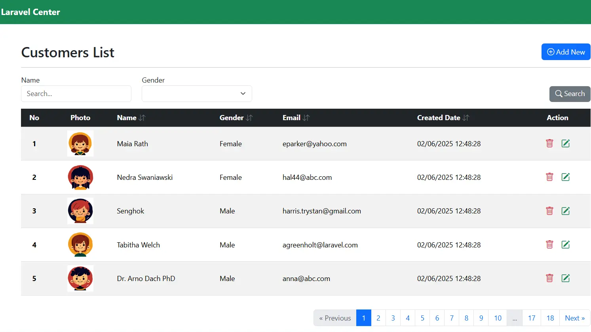

# Inertia CRUD with Laravel & Vue.js
<p align="center"><a href="https://laravelcenter.com/inertia-crud-laravel-vue" target="_blank"></a></p>

[](https://laravel.com/)
[](https://inertiajs.com/)
[](https://vuejs.org/)
[](https://www.php.net/)
[](https://getbootstrap.com/)

This repository contains the complete source code for the tutorial:  
👉 **Inertia CRUD from Scratch Using Laravel and Vue.js – Full Step-by-Step Guide**  
Read the full tutorial here:  
https://laravelcenter.com/inertia-crud-laravel-vue/

Learn how to build a full CRUD system using **Laravel 12**, **Inertia.js**, **Vue 3**, and **Bootstrap 5**, without using APIs. Everything works seamlessly as one single-page app powered by Inertia.

---

## 🚀 Features

- Full **CRUD operations** (Create, Read, Update, Delete)  
- **Inertia.js** for SPA-like navigation  
- **Vue.js 3** Composition API  
- **Bootstrap 5 UI** components  
- Form validation with error messages  
- Smooth navigation without page reloads  
- Clean Laravel controller & routing structure  
- Beginner-friendly and easy to extend  

---

## 🛠 Installation

```bash
# Clone this repository
git clone https://github.com/YourUsername/inertia-crud-laravel-vue.git
cd inertia-crud-laravel-vue

# Install backend dependencies
composer install

# Install frontend dependencies
npm install

# Build frontend assets
npm run dev

# Copy environment file
cp .env.example .env
php artisan key:generate

# Run database migrations
php artisan migrate

# Start development server
php artisan serve

```

## 📦 Tech Stack
- Laravel 12
- Inertia.js
- Vue.js 3
- Bootstrap 5
- PHP 8+
- MySQL

## 🔗 Tutorial
Follow the full step-by-step tutorial here:
[**https://laravelcenter.com/inertia-crud-laravel-vue**](https://laravelcenter.com/inertia-crud-laravel-vue/)

## 📌 Topics / Tags
`laravel` | `inertia` | `inertiajs` | `vue` | `vue3` | `crud` | `bootstrap` | `laravel-crud` | `spa` | `tutorial`


## ⭐ Support
If this tutorial helps you, please star this repository and follow me on GitHub.
Your support motivates me to create more high-quality, free tutorials.
